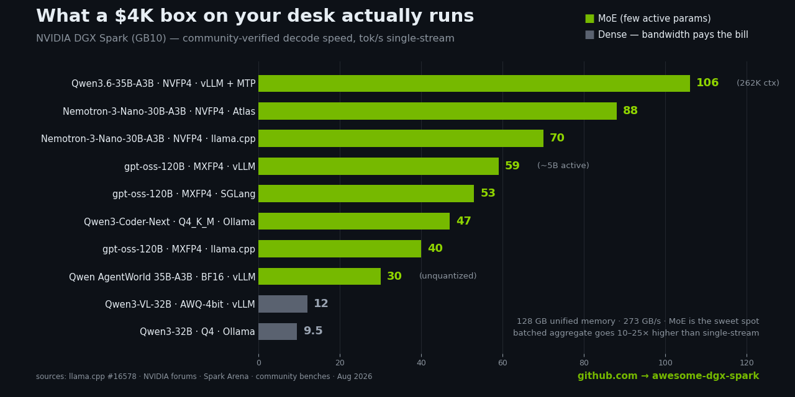

# ⚡ Awesome DGX Spark

**A curated list of awesome NVIDIA DGX Spark tutorials, projects and communities.**

*A petaflop on your desk. 128 GB of unified memory. The whole local-AI stack — curated in one place.*

---

## 🤔 What is DGX Spark?

The **NVIDIA DGX Spark** is a personal AI supercomputer built around the **GB10 Grace Blackwell Superchip** — a 20-core Grace ARM CPU fused with a Blackwell GPU (SM 12.1 / `sm_121`) sharing **128 GB of coherent unified memory**, delivering up to **~1 PFLOP of FP4 compute** in a box the size of a Mac Mini. Two ConnectX-7 200 Gb/s QSFP ports let you chain Sparks into clusters over RDMA/RoCE.

Translation: you can run 100B+ parameter models, fine-tune LLMs, and build multi-node inference rings **on your desk, fully local, no cloud bill.**

> 🧠 **The catch:** it's aarch64 + CUDA 13 + a brand-new GPU architecture. Half the fun (and half the pain) is that the ecosystem is being built *right now* — by the people in this list.

---

## 🏎️ What Actually Runs on a Spark (Real Numbers)

The question everyone asks first. Community-verified **decode speeds (tok/s, single-stream unless noted)** — every row links to its source so you can reproduce it.

### Single Spark

| Model | Quant | Engine | tok/s | Source |
|---|---|---|---:|---|
| Qwen3.6-35B-A3B *(full 262K ctx!)* | NVFP4 | vLLM + MTP spec decode (k=3) | **~106** | [howtospark.com](https://howtospark.com/) |
| Nemotron-3-Nano-30B-A3B | NVFP4 | Atlas (Rust+CUDA) | **~84–88** | [Sggin1/DGX-SPARK](https://github.com/Sggin1/DGX-SPARK) |
| Nemotron-3-Nano-30B-A3B | NVFP4 | llama.cpp | ~70 | [llama.cpp #16578](https://github.com/ggml-org/llama.cpp/discussions/16578) |
| gpt-oss-120B | MXFP4 | vLLM | ~59 | [llama.cpp #16578](https://github.com/ggml-org/llama.cpp/discussions/16578) |
| Nemotron-3-Nano-30B-A3B | NVFP4 | vLLM | ~56 | [llama.cpp #16578](https://github.com/ggml-org/llama.cpp/discussions/16578) |
| gpt-oss-120B | MXFP4 | SGLang | ~53 | [NVIDIA forums](https://forums.developer.nvidia.com/t/investigating-performance-issue-bottleneck/359200) |
| Qwen3-Coder-Next | Q4_K_M | Ollama | ~47 | [ai-muninn 8-model bench](https://ai-muninn.com/en/blog/dgx-spark-ollama-benchmark-8-models) |
| gpt-oss-120B | MXFP4 | llama.cpp | ~40 | [llama.cpp #16578](https://github.com/ggml-org/llama.cpp/discussions/16578) |
| gpt-oss-120B *(real agent workload, JSON out)* | MXFP4 | vLLM | ~34 single / **~863 aggregate** batched | [Dendro Logic concurrency bench](https://dendro-logic.com/engineering/nvidia-dgx-spark-concurrency-benchmark/) |
| Qwen AgentWorld 35B-A3B | BF16 (unquantized) | vLLM | ~30 | [howtospark.com](https://howtospark.com/) |
| Qwen3-VL-32B *(dense)* | AWQ 4-bit | vLLM | ~12 | [NVIDIA forums](https://forums.developer.nvidia.com/t/investigating-performance-issue-bottleneck/359200) |
| Qwen3-32B *(dense)* ⚠️ | Q4 | Ollama | ~9.5 | [NVIDIA forums](https://forums.developer.nvidia.com/t/dgx-spark-performance/356716) |

### Multi-Spark Clusters

| Model | Quant | Engine | Setup | tok/s | Source |
|---|---|---|---|---:|---|
| gpt-oss-120B | MXFP4 | vLLM | 2× Spark | **~76** | [llama.cpp #16578](https://github.com/ggml-org/llama.cpp/discussions/16578) |
| Qwen3-Coder-Next | FP8 | SGLang | 2× Spark | ~61 | [llama.cpp #16578](https://github.com/ggml-org/llama.cpp/discussions/16578) |
| DeepSeek-V4-Flash *(1M context!)* | — | DSpark fork | 2× Spark | 60+ | [Entrpi/ds4](https://github.com/topics/dgx-spark) |
| GLM-5.2 *(753B MoE)* @ 96K ctx | 2-bit experts + NVFP4 attn | vLLM + speculator | 2× Spark TP2 | ~26 | [howtospark.com](https://howtospark.com/) |
| Qwen3-VL-235B-A22B | NVFP4 | vLLM | 2× Spark | ~21 | [NVIDIA forums](https://forums.developer.nvidia.com/t/investigating-performance-issue-bottleneck/359200) |
| GLM-4.7-FP8 *(355B MoE)* | FP8 | SGLang + EAGLE | 4× Spark | ✅ runs | [NVIDIA forums](https://forums.developer.nvidia.com/c/accelerated-computing/dgx-spark-gb10/dgx-spark-gb10-projects/723) |

**📐 How to read this table:**

- ⚡ **MoE crushes dense.** A 120B MoE (~5B active params) decodes 4–6× faster than a 32B dense model. The 273 GB/s bandwidth is the law — active parameters are what you pay for.
- 🎯 **Speculative decoding is free speed.** MTP/EAGLE/DFlash draft heads add 50%+ on coding and structured output. If your model ships an MTP head, use it.
- 📦 **Batch it.** Single-stream numbers are the *floor* — the same gpt-oss-120B that does ~34 tok/s solo pushes **~860 tok/s aggregate** under concurrency. Sparks are throughput machines.
- 🐘 **Big-model party trick:** Qwen3.5-122B-A10B in NVFP4 shrinks from 234 GB → [~75 GB and fits on one Spark](https://forums.developer.nvidia.com/c/accelerated-computing/dgx-spark-gb10/dgx-spark-gb10-projects/723) — a forum favorite for "best single-Spark model."

> 📊 Numbers move fast — engines, kernels and quants improve monthly (the CES 2026 update alone was up to 2.5×). For live, reproducible results check **[Spark Arena](https://spark-arena.com/)**. Got better numbers? **[PR the table!](#-contributing)**

---

## 📋 Contents

- [🏎️ What Actually Runs on a Spark](#️-what-actually-runs-on-a-spark-real-numbers)
- [🚀 Getting Started](#-getting-started)
- [📖 Official Resources](#-official-resources)
- [🎓 Tutorials & Guides](#-tutorials--guides)
- [🔥 Inference Engines](#-inference-engines)
- [📊 Benchmarks & Leaderboards](#-benchmarks--leaderboards)
- [🔗 Multi-Spark Clustering](#-multi-spark-clustering)
- [🛠️ Projects & Tools](#️-projects--tools)
- [🎨 Image, Video & Audio](#-image-video--audio)
- [🧪 Fine-tuning & Training](#-fine-tuning--training)
- [✍️ Reviews & Deep Dives](#️-reviews--deep-dives)
- [👥 Communities](#-communities)
- [🤝 Contributing](#-contributing)

---

## 🚀 Getting Started

New Spark just arrived? Do these in order:

1. **[NVIDIA DGX Spark Playbooks](https://github.com/NVIDIA/dgx-spark-playbooks)** — NVIDIA's official collection of 30+ step-by-step playbooks: LLM serving, fine-tuning, diffusion, dual-Spark clustering. Start here.
2. **[DGX Spark Documentation](https://docs.nvidia.com/dgx/dgx-spark/)** — Official docs: setup, OS, firmware, networking.
3. **[NVIDIA Developer Forums — DGX Spark](https://forums.developer.nvidia.com/c/accelerated-computing/dgx-user-forum/)** — Where the real troubleshooting happens. Search before you suffer.
4. Pick an inference engine below and serve your first model. 🎉

> 💡 **Rule of thumb from the community:** MoE models are the sweet spot for Spark's 273 GB/s memory bandwidth. GPT-OSS-120B, GLM-4.x Air/Flash, and Qwen3-30B variants run great; big *dense* models will feel slow.

---

## 📖 Official Resources

- [NVIDIA DGX Spark Product Page](https://www.nvidia.com/en-us/products/workstations/dgx-spark/) — Specs, ordering, partner systems (ASUS Ascent GX10, Dell, HP, Lenovo variants).
- [NVIDIA/dgx-spark-playbooks](https://github.com/NVIDIA/dgx-spark-playbooks) — Official playbooks repo, including the [dual-Spark benchmarking guide](https://github.com/NVIDIA/dgx-spark-playbooks/blob/main/nvidia/connect-two-sparks/assets/performance_benchmarking_guide.md).
- [NGC Catalog](https://catalog.ngc.nvidia.com/) — Prebuilt CUDA/PyTorch/TensorRT containers for aarch64 — your best friend on this platform.
- [CUDA on ARM / DGX Spark porting notes](https://docs.nvidia.com/dgx/dgx-spark/) — Which libraries are supported (and which aren't yet) on aarch64.

---

## 🎓 Tutorials & Guides

- [Kubesimplify — Local LLM series on DGX Spark](https://blog.kubesimplify.com/day-5-local-llm-inference-engines-wrappers-and-what-to-pick) — Beginner-friendly multi-part series: quantization demystified (BF16/FP8/NVFP4/MXFP4/GGUF) and the same Qwen model tested through Ollama, llama.cpp, vLLM, SGLang, Docker Model Runner and TensorRT-LLM.
- [Four Inference Engines, One Box](https://medium.com/@michael.hannecke/four-inference-engines-one-box-when-to-use-which-on-the-dgx-spark-6b32a53db768) — A workload-driven decision guide for vLLM vs SGLang vs llama.cpp vs TensorRT-LLM on the Spark.
- [csabakecskemeti/dgx-spark-community-playbooks](https://github.com/csabakecskemeti/dgx-spark-community-playbooks) — Community playbooks: dual-Spark RDMA inference, heterogeneous RoCE clustering, running Claude Code against local models.
- [GuigsEvt/dgx_spark_config](https://github.com/GuigsEvt/dgx_spark_config) — Building the whole stack from source (LLVM → Triton → PyTorch) against GB10 libraries. For the brave.
- [jl-codes/dgx-spark-ai](https://github.com/jl-codes/dgx-spark-ai) — A curriculum for running GPT-OSS-120B on Spark, with unified-memory architecture lessons.
- [install-safe-press/gb10-playbooks](https://github.com/install-safe-press/gb10-playbooks) — 🇨🇳 Chinese-language walkthrough of all official GB10 playbooks with extra hardware/networking/clustering notes + companion videos.
- [raibid-labs/osai](https://github.com/raibid-labs/osai) — "Your $4,000 datacenter": comprehensive self-hosted AI infrastructure guide on DGX Spark.

---

## 🔥 Inference Engines

The big question on every Spark: *what do I serve with?*

| Engine | Best for | Spark notes |
|---|---|---|
| **[TensorRT-LLM](https://github.com/NVIDIA/TensorRT-LLM)** | Raw speed, NVFP4 | NVIDIA's own; the CES 2026 update brought up to 2.5× perf gains via TRT-LLM optimizations + speculative decoding |
| **[vLLM](https://github.com/vllm-project/vllm)** | Throughput, OpenAI-compatible serving | Use community GB10 docker builds (below) to dodge aarch64/sm_121 pitfalls |
| **[SGLang](https://github.com/sgl-project/sglang)** | Agentic workloads, shared prefixes, structured output | RadixAttention shines on tool-calling loops |
| **[llama.cpp](https://github.com/ggml-org/llama.cpp)** | GGUF simplicity, minimal deps | See the epic [Spark performance mega-thread](https://github.com/ggml-org/llama.cpp/discussions/16578) |
| **[Ollama](https://github.com/ollama/ollama)** | Easiest start | Ships in NVIDIA's playbooks; great first-hour experience |

**GB10-specific builds & fixes:**

- [eugr/spark-vllm-docker](https://github.com/eugr/spark-vllm-docker) — The canonical community vLLM docker config for single and dual Sparks. Used verbatim by half the ecosystem.
- [Avarok-Cybersecurity/dgx-vllm](https://github.com/Avarok-Cybersecurity/dgx-vllm) — Custom vLLM image patching CUTLASS + FlashInfer around missing SM121 PTX paths, with GB10-tuned MoE Triton configs.
- [cslev/llamacpp-cuda-arm64-docker](https://github.com/cslev/llamacpp-cuda-arm64-docker) — Build your own CUDA llama.cpp Docker image for ARM64/Spark.
- [Albatross1382/onnxruntime-aarch64-cuda-blackwell](https://github.com/Albatross1382/onnxruntime-aarch64-cuda-blackwell) — ONNX Runtime with CUDA EP prebuilt for sm_121 aarch64.

---

## 📊 Benchmarks & Leaderboards

- 🏆 **[Spark Arena](https://spark-arena.com/)** — The community LLM performance leaderboard for the Spark: structured, *reproducible* benchmark submissions with full CLI flags, runtime versions, quantization and topology captured. Real numbers from real Spark owners.
- [spark-arena/recipe-registry](https://github.com/spark-arena/recipe-registry) — 100+ curated, executable serving recipes (model + engine + flags).
- [eugr/llama-benchy](https://github.com/eugr/llama-benchy) — llama-bench-style benchmarking across *all* backends.
- [llama.cpp on DGX Spark — Discussion #16578](https://github.com/ggml-org/llama.cpp/discussions/16578) — Long-running community performance thread; the folklore archive of GB10 tok/s numbers.
- [NVIDIA performance benchmarking guide](https://github.com/NVIDIA/dgx-spark-playbooks/blob/main/nvidia/connect-two-sparks/assets/performance_benchmarking_guide.md) — Official methodology: trtllm-bench, RDMA bandwidth/latency between Sparks.

---

## 🔗 Multi-Spark Clustering

One Spark is a workstation. Two Sparks over a single CX-7 cable is a **~200 Gb/s RDMA cluster**. Then it escalates.

- [NVIDIA "Connect Two Sparks" playbook](https://github.com/NVIDIA/dgx-spark-playbooks) — Official dual-node setup: RoCE interfaces, IP assignment, NCCL.
- [Sggin1/DGX-SPARK](https://github.com/Sggin1/DGX-SPARK) — Field-tested dual-Spark runbook covering the two failure classes that burn the most forum hours: power-path throttling and NCCL/RoCE misconfig (UFW, GID index, half-bandwidth twins). Verified ~195–197 Gb/s aggregate.
- [spark-arena/sparkrun](https://github.com/spark-arena/sparkrun) — Multi-node workload launcher for Spark clusters.
- [getainode/ainode](https://github.com/getainode/ainode) — Browser-UI AI appliance with UDP-discovered multi-Spark tensor-parallel clustering — verified on a 4-node, 487 GB cluster.

---

## 🛠️ Projects & Tools

- [TheAwaken1/Spark-Studio](https://github.com/TheAwaken1/Spark-Studio) — Inference dashboard uniting vLLM, SGLang, llama.cpp, WebGPU and sparkrun, with agent-powered Auto-Fix that diagnoses failed runs and patches the recipe until the engine serves.
- [jasonacox/dgx-spark](https://github.com/jasonacox/dgx-spark) — Helpful tools and projects for the Spark, including nanochat (train an LLM from scratch on GB10).
- [HeKun-NVIDIA/dgx-spark-openclaw](https://github.com/HeKun-NVIDIA/dgx-spark-openclaw) — One-command deploy of a local LLM + OpenClaw agent frontend using a GB10 NVFP4 vLLM image.
- [botAGI/AGmind](https://github.com/botAGI/AGmind) — One-command private RAG stack for GB10 with dual-Spark support and 30+ containers.
- [HendrikSchoettle/ragflow-dgx-spark](https://github.com/HendrikSchoettle/ragflow-dgx-spark) — RAGFlow on Spark aarch64, with a source-built onnxruntime-gpu wheel for sm_121 and multilingual OCR.
- [Avarok-Cybersecurity/atlas](https://github.com/Avarok-Cybersecurity/atlas) — Pure Rust+CUDA inference engine benchmarked on GB10.
- [rakpan/project-vyasa](https://github.com/rakpan/project-vyasa) — Local-first research execution framework: turn unstructured documents into evidence-bound manuscripts, all on-device.

---

## 🎨 Image, Video & Audio

- ComfyUI for GB10/sm_121a — bleeding-edge builds with CUDA 13, SageAttention v3 and NVFP4, pre-bundled with Flux 2 Dev / LTX video / ACE-Step audio (search the [`dgx-spark` topic](https://github.com/topics/dgx-spark) for current images — they iterate fast).
- [operezmuena/voxcpm-1.5-fastapi-server](https://github.com/operezmuena/voxcpm-1.5-fastapi-server) — Dockerized FastAPI TTS server (VoxCPM) tuned for Spark.
- [NVIDIA playbooks — diffusion workloads](https://github.com/NVIDIA/dgx-spark-playbooks) — Official image-gen setups.

---

## 🧪 Fine-tuning & Training

- [NVIDIA playbooks — fine-tuning](https://github.com/NVIDIA/dgx-spark-playbooks) — LoRA and full fine-tuning recipes sized for 128 GB unified memory.
- [getainode/ainode](https://github.com/getainode/ainode) — LoRA fine-tuning *and* inference in one appliance UI.
- [Sebastian Raschka — DGX Spark and Mac Mini for Local PyTorch Development](https://sebastianraschka.com/) — Hands-on PyTorch training/fine-tuning benchmarks and takeaways from one of the most respected voices in applied ML.
- [jasonacox/dgx-spark → nanochat](https://github.com/jasonacox/dgx-spark) — Train an LLM completely from scratch, optimized for Spark's architecture.

---

## ✍️ Reviews & Deep Dives

- [Simon Willison — DGX Spark review](https://simonwillison.net/tags/nvidia-spark/) — The famous first-impressions series: CUDA-on-ARM learning curve, Docker workflow, Tailscale setup, running coding agents against local models.
- [The Register — DGX Spark coverage](https://www.theregister.com/) — "Your existing code should work out of the box" — CUDA-ecosystem angle, plus coverage of the CES 2026 2.5× software update.
- [IntuitionLabs — comprehensive review & benchmark roundup](https://intuitionlabs.ai/articles/nvidia-dgx-spark-review) — Aggregates official specs, expert reviews and forum consensus; honest about the 273 GB/s bandwidth ceiling vs. Strix Halo and Apple Silicon.
- [Level1Techs — DGX Spark review](https://level1techs.com/) — Hardware-first perspective on the GB10 platform.

---

## 👥 Communities

| Community | What happens there |
|---|---|
| [NVIDIA Developer Forums — DGX Spark](https://forums.developer.nvidia.com/c/accelerated-computing/dgx-user-forum/) | The primary hub: firmware issues, perf debugging, NVIDIA engineers actually reply |
| [Spark Arena Discord](https://spark-arena.com/) | Benchmark recipes, tuning collab, leaderboard submissions |
| [r/LocalLLaMA](https://www.reddit.com/r/LocalLLaMA/) | Spark vs Strix Halo vs Mac Studio flame wars, real-world reports |
| [llama.cpp Discussions](https://github.com/ggml-org/llama.cpp/discussions/16578) | The GB10 performance mega-thread |
| [X/Twitter: @spark_arena](https://x.com/spark_arena) | Community news, new recipe drops |

---

## ⚡ Quick Spec Card

| | |
|---|---|
| **Chip** | GB10 Grace Blackwell Superchip (SM 12.1 / `sm_121`, aarch64) |
| **CPU** | 20-core Arm (10× Cortex-X925 + 10× Cortex-A725) |
| **Memory** | 128 GB LPDDR5x unified, ~273 GB/s |
| **AI Compute** | up to ~1 PFLOP FP4 (sparse) |
| **Networking** | ConnectX-7, 2× QSFP (200 Gb/s), RDMA/RoCE |
| **Killer feature** | NVFP4 hardware + CUDA on a desk |
| **Known limit** | Memory bandwidth — favor MoE models |

---

## 🤝 Contributing

Found an awesome Spark project, tutorial, or benchmark? **PRs are very welcome!**

1. Fork this repo
2. Add your link in the right section: `[name](url) — one-line description of why it's awesome.`
3. One link per PR keeps reviews fast
4. It should be *specifically useful for DGX Spark / GB10* — generic AI links belong in other awesome lists

Please read [CONTRIBUTING.md](CONTRIBUTING.md) first.

---

**⭐ If this list saved you a weekend of aarch64 debugging, star it so it finds the next Spark owner. ⭐**

*Built by the community, for the community. Not affiliated with NVIDIA.*

